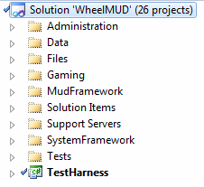

# WheelMUD Solution Structure

We have tried to organized the code into logical groupings, in solution folders and projects. The current solution structure looks like this:

Here's a brief explanation of each solution folder: 

| Folder          | Description |
| --------------- | ----------- |
| Administration  | This is where anything related to editing the server contents or configuration goes. |
| Data            | The low level database code goes here. Known commonly as the Data Abstraction Layer (DAL). |
| Files           | These are files such as configuration, opening screens, and NVelocity templates. |
| Gaming          | This is where the gaming system implementation goes. |
| MudFramework    | This is where the bulk of the MUD server code lives. |
| SystemFramework | This is where reusable code that is not MUD related lives. Loggers, encryption and other tools. |
| Support Servers | This is where servers like FTP are located. |
| Tests           | This is where the unit tests live. We need help here. |
| TestHarness     | This is a console project which runs the server. |
