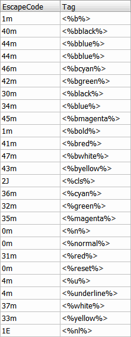

# How To: Color Text in WheelMUD

## Tagging
We are using a very similar tagging scheme as MudOS.
ASP.NET programmers will feel right at home.
For supported options, the ANSI codes can be found in the CodeSequenceMap field in AnsiHandler.cs 
Here's what they look like:

Use the entries in the Tag column.
The tags come in pairs just like any tag based mark-up language like HTML, ASP, and XML. Make sure to reset the colors buy using the normal or reset tags.

You can also refer to the AnsiHandler Parse method to refresh on the Tags that are supported.

## Extension Considerations
