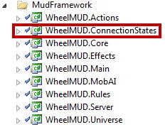
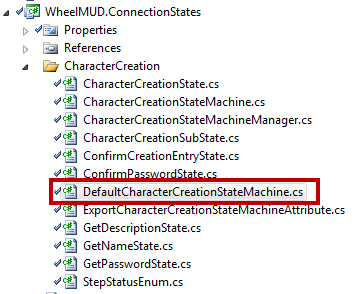
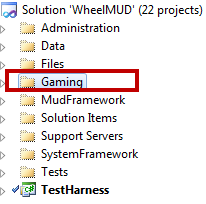

# How To: Customize Character Creation in WheelMUD

## Customizing Character Creation
Customizing the character creation process needs a bit of knowledge of C#.
However the WheelMUD team has done a great job of simplifying the process for us.
(This walk-through is verified accurate against WheelMUD v0.4.)

First, locate the WheelMUD.ConnectionStates project.



Next locate the DefaultCharacterCreatingStateMachine.cs file.



This class will serve as your template for your customization. It will also be the starting point for your coding. This class will tell your character creation system what step to run, and which one is next. Let's walk through the different methods, what they are for, and how they should be used. 

First let's start with the class declaration:
```
[ExportCharacterCreationStateMachine(100)]
public class DefaultCharacterCreationStateMachine : CharacterCreationStateMachine
```
Notice that this class definition is decorated by the ExportCharacterCreationStateMachine attribute. This is what tells the Management Extensibility Framework (MEF) that this is a a character creation state machine, and that it needs to load it into memory. This attribute has a value of 100. Your custom state machine will need a higher value. Our system is designed to use whatever state machine has the highest value. Change DefaultCharacterCreationStateMachine to whatever you want to name your custom system.

The next piece of code is what tells the state machine where to start. 
```
public override CharacterCreationSubState GetNextStep(CharacterCreationSubState current, StepStatus previousStatus)
{
    // entry point of the state machine
    if (current == null)
    {
        return new ConfirmCreationEntryState(Session);
    }
 
    if (previousStatus == StepStatus.Success)
    {
        return AdvanceState(current);
    }
    else
    {
        return RegressState(current);
    }
}
```

You don't need to change this function. Leave it as it is. The next function is where the meat of your changes will take place. 
```
private CharacterCreationSubState AdvanceState(CharacterCreationSubState current)
{
    // This character creation state machine can return actual creation state objects - if someone
    // were to expand and add new creation state(s) that are not MUD-agnostic, then they should also
    // add and use their own CreationStateMachine handling those states instead of this default one;
    // they could of course reuse some/all of the states below in addition to their own.
    if (current is ConfirmCreationEntryState)
    {
        return new GetNameState(Session);
    }
    else if (current is GetNameState)
    {
        return new GetDescriptionState(Session);
    }
    else if (current is GetDescriptionState)
    {
        return new GetPasswordState(Session);
    }
    else if (current is GetPasswordState)
    {
        return new ConfirmPasswordState(Session);
    }
    else if (current is ConfirmPasswordState)
    {
        // We are done with character creation!
        return null;
    }
 
    throw new InvalidOperationException("The character state machine does not know how to calculate the next step after '" + current.GetType().Name + "' succeeds");
}
```
The if statements above check for a specific step, or state in state machine nomenclature, and tells the state machine what is next. The last step in your custom system must return null. The null value is what will tell it that is is done, and can continue to place the new player in your world.

Sometimes, you have the need to go back a step. Here is where this is handled: 
```
private CharacterCreationSubState RegressState(CharacterCreationSubState current)
{
    if (current is ConfirmPasswordState)
    {
        // If password confirmation failed, try selecting a new password.
        return new GetPasswordState(Session);
    }
 
    throw new InvalidOperationException("The character state machine does not know how to calculate the next step after '" + current.GetType().Name + "' fails");
}
```
So that's it for this class. Let's go create a new custom step. But first, lets setup a new project to house our custom stuff. Lets call our new system, "OneHitWonder".

Navigate to the Gaming solution folder.



Once there, create a new project called OneHitWonder. Make sure that you create it as a Class Library project.


Copy the contents of DefaultCharacterCreationStateMachine.cs into OneHitWonderCharacterCreationStateMachine.cs. First lets change the namespace to OneHitWonder.CharacterCreation. Then lets change the class header like this: 
```
ExportCharacterCreationStateMachine(300)
public class OneHitWonderCharacterCreationStateMachine : CharacterCreationStateMachine
```
As I said before, you need to change the value in the ExportCharacterCreationStateMachine attribute. I changed it to 300. This will ensure that our system will be picked up, instead of the default one. Make sure that the constructors are changed as well to the new class name. 
```
public OneHitWonderCharacterCreationStateMachine(Session session)
    : base(session)
{
}
 
public OneHitWonderCharacterCreationStateMachine()
    : this(null)
{
}
```
Leave the rest of the class alone for now. Let's go to the custom step now. Let's make a new step that will pick the player's gender. I'm going to call it PickGenderState.cs, but you can call it whatever you want.

A blank custom state/step looks like this: 
```
namespace OneHitWonder.CharacterCreation
{
    using WheelMUD.ConnectionStates;
    using WheelMUD.Core;
 
    /// <summary>
    /// The character creation step where the player will pick their gender.
    /// </summary>
    public class PickGenderState : CharacterCreationSubState
    {
        /// <summary>
        /// Initializes a new instance of the <see cref="PickGenderState"/> class.
        /// </summary>
        /// <param name="session">
        /// The session.
        /// </param>
        public PickGenderState(Session session) : base(session)
        {
        }
 
        /// <summary>
        /// ProcessInput is used to receive the user input during this state.
        /// </summary>
        /// <param name="command">The command text to be processed.</param>
        public override void ProcessInput(string command)
        {
        }
    }
}
```
ProcessInput is where you will do the bulk of the work for the custom state. Lets get started with the constructor first. We need to let the player know what is happening. Here is the completed code that will go into the constructor: 
```
public PickGenderState(Session session) : base(session)
{
    Session.Write("You will now pick your character's gender.");
    Session.SetPrompt("Selecting the character's gender ==>");
 
    RefreshScreen();
}
```

Session.Write is how we send text to the player's screen. We set the prompt message. This message will stay there until we change the prompt to something else. RefreshScreen() is what we will call whenever we want to show the main screen. Here's the code for that: 
```
private void RefreshScreen()
{
    var sb = new StringBuilder();
    sb.AppendAnsiLine("+++++++");
    sb.AppendAnsiLine("You have the following gender choices:");
    sb.AppendAnsiLine("Male");
    sb.AppendAnsiLine("Female");
    sb.AppendAnsiLine("Eunuch");
    sb.AppendAnsiLine();
    if (string.IsNullOrEmpty(playerGender))
    {
        sb.AppendAnsiLine("<%b%><%red%>No gender has been selected.<%n%>");
    }
    else
    {
        sb.AppendAnsiLine($"<%green%>The chosen gender is {playerGender}.<%n%>");
    }
 
    sb.AppendAnsiLine("<%yellow%>===============================================================");
    sb.AppendAnsiLine("To pick a gender use the select command. Example: select female");
    sb.AppendAnsiLine("When you are done picking a gender type done.");
    sb.AppendAnsiLine("===============================================================<%n%>");
 
    Session.Write(sb.ToString());
}
```

I'm not doing anything fancy there. Just putting together some text. At the bottom of the screen, I'm letting the player know what commands are valid while in this state. I'm only going to allow "select" and "done". So now we move to processing what the player types while in this state. Lets go back to ProcessInput.
```
public override void ProcessInput(string command)
{
    string currentCommand = GetCommandPart(command.ToLower());
 
    switch (currentCommand)
    {
        case "select":
            SetGender(command.ToLower());
            break;
        case "done":
            ProcessDone();
            break;
        default:
            OneHitWonderChargenCommon.SendErrorMessage(Session, "Invalid command. Please use select or done.");
            break;
    }
} 
 
private string GetCommandPart(string command)
{
    string retval = string.Empty;
 
    try
    {
        retval = Regex.Match(command, @"select|done").Value;
    }
    catch (ArgumentException)
    {
        // Syntax error in the regular expression
    }
 
    return retval;
}
```

The first thing we want to do in these states is to filter out the commands that we want. I'm doing this in the GetCommand() function. It is using a simple regular expression to determine if select or done are in the text that the player just typed. The regular expression will return "select" or "done", and I use a switch statement to process those. For the select command, I just set a variable. You could just as easily set a property to a string or whatever else you are using to keep track of this. Here's what is in SetGender(): 
```
private void SetGender(string command)
{
    string currentGender = command.Replace("select ", string.Empty);
 
    switch (currentGender.ToLower())
    {
        case "male":
        case "female":
        case "eunuch":
            playerGender = currentGender;
            break;
        default:
            OneHitWonderChargenCommon.SendErrorMessage(Session, string.Format("'{0}' is an invalid gender selection.", currentGender));
            break;
    }
 
    RefreshScreen();
}
```
I'm just setting a private variable to what is sent through the command parameter to the playerGender private global variable. If the player sends something other than the what the range of selections are, I send error text to the player. I created a class that contains some helpful methods. SendErrorMessage is used through other steps. Here is what's in there:
```
public static void SendErrorMessage(Session session, string message)
{
    var divider = new StringBuilder();
    var wrappedMessage = new StringBuilder();
 
    foreach (char t in message)
    {
        divider.Append("=");
    }
 
    wrappedMessage.Append("<%red%>" + divider + Environment.NewLine);
    wrappedMessage.Append(message + Environment.NewLine);
    wrappedMessage.Append(divider + "<%n%>");
 
    session.Write(wrappedMessage.ToString());
}
```
This is just formatting the text in red, sandwiched between rows of =, on the top and the bottom of the message. Now, lets go back to ProcessInput(). Once the player is done, they get moved to the next step. Lets see what ProcessDone() does: 
```
private void ProcessDone()
{
    // Proceed to the next step.
    Session.SetPrompt(">");
    StateMachine.HandleNextStep(this, StepStatus.Success);
}
```
I'm first setting the prompt to >, to alert the player that we are done. Then we tell the state machine to do the next step. The StepStatus.Success tells the state machine that it was successful, and that it need to move to the next step. So now we are done creating this custom step. We still have one more thing to do, before this state/step becomes active. We need to go back to the OneHitWonderCharacterCreationStateMachine class, and wire up our new state. Here is what the original looked like: 
```
private CharacterCreationSubState AdvanceState(CharacterCreationSubState current)
{
    // This character creation state machine can return actual creation state objects - if someone
    // were to expand and add new creation state(s) that are not MUD-agnostic, then they should also
    // add and use their own CreationStateMachine handling those states instead of this default one;
    // they could of course reuse some/all of the states below in addition to their own.
    if (current is ConfirmCreationEntryState)
    {
        return new GetNameState(Session);
    }
    else if (current is GetNameState)
    {
        return new GetDescriptionState(Session);
    }
    else if (current is GetDescriptionState)
    {
        return new GetPasswordState(Session);
    }
    else if (current is GetPasswordState)
    {
        return new ConfirmPasswordState(Session);
    }
    else if (current is ConfirmPasswordState)
    {
        // We are done with character creation!
        return null;
    }
 
    throw new InvalidOperationException("The character state machine does not know how to calculate the next step after '" + current.GetType().Name + "' succeeds");
}
```
Here is what this looks like with the new state/step added in: 
```
private CharacterCreationSubState AdvanceState(CharacterCreationSubState current)
{
    // This character creation state machine can return actual creation state objects - if someone
    // were to expand and add new creation state(s) that are not MUD-agnostic, then they should also
    // add and use their own CreationStateMachine handling those states instead of this default one;
    // they could of course reuse some/all of the states below in addition to their own.
    if (current is ConfirmCreationEntryState)
    {
        return new GetNameState(Session);
    }
    else if (current is GetNameState)
    {
        return new GetDescriptionState(Session);
    }
    else if (current is GetDescriptionState)
    {
        return new GetPasswordState(Session);
    }
    else if (current is GetPasswordState)
    {
        return new ConfirmPasswordState(Session);
    }
    else if (current is ConfirmPasswordState)
    {
        return new PickGenderState(Session);
    }
    else if (current is PickGenderState)
    {
        // We are done with character creation!
        return null;
    }
 
    throw new InvalidOperationException("The character state machine does not know how to calculate the next step after '" + current.GetType().Name + "' succeeds");
}
```
The last step was ConfirmPasswordState in the original version. I am making ConfirmPasswordState move to PickGenderState, as the next state/step. So now PickGenderState is the last step, and returns null to tell the state machine that we are done. And there you have it. This is how you create your own custom character creation and custom steps.

Notice that I am using steps that are in the default state machine. You can go an create your own, but I decided that I didn't want to recreate them. WheelMUD keeps track of what the player is doing, by having player states. We currently have 4 player states:
* ConnectedState: his state is for handling telnet negotiations and to get stuff from the player's MUD client.
* CreationState: This is where character creation happens.
* LoginState: Handles login for the player
* PlayingState: This is where the player can use the normal MUD commands.
Feel free to ask questions in the forums.
